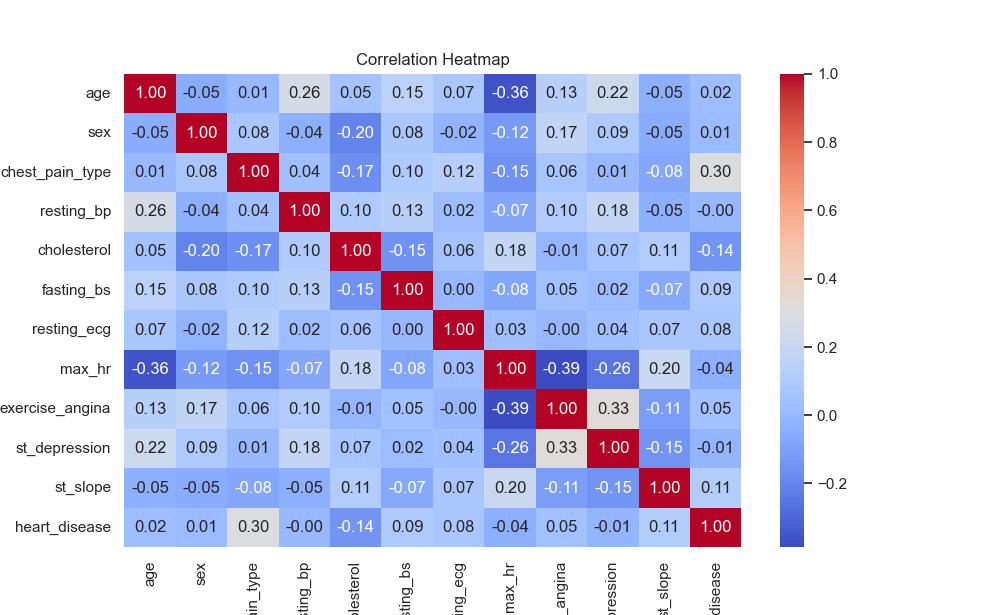
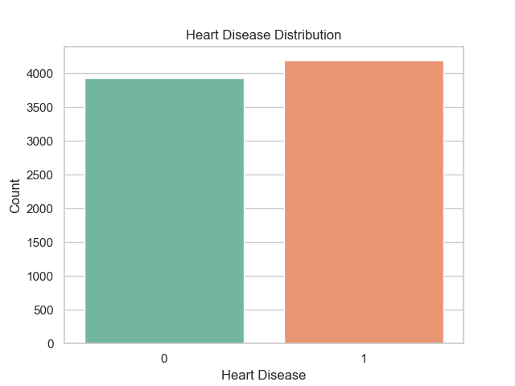
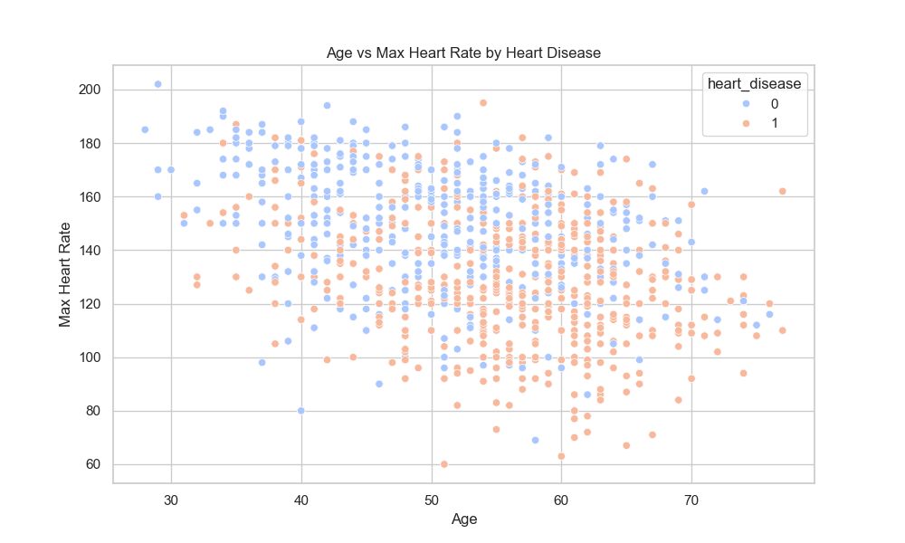
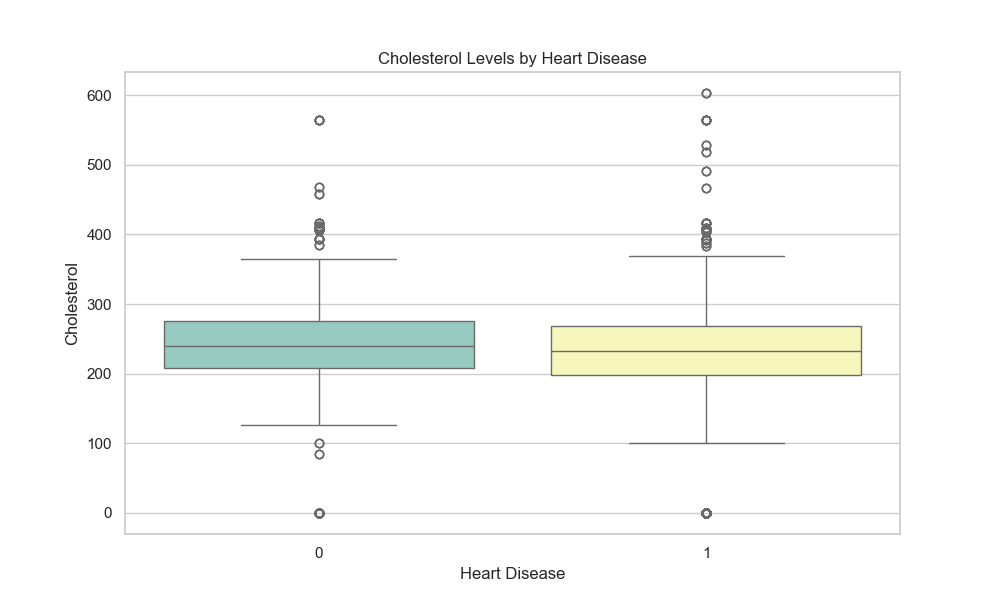
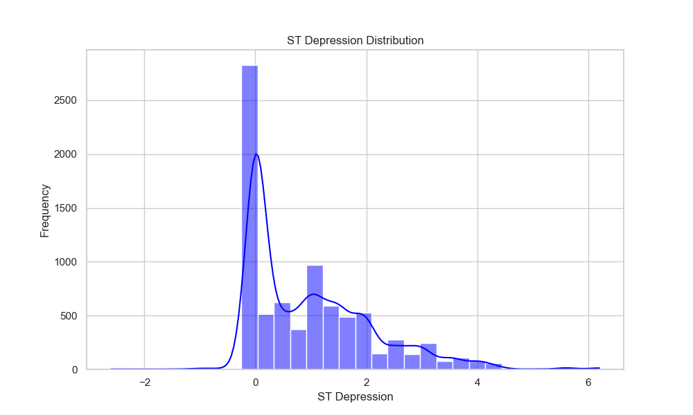
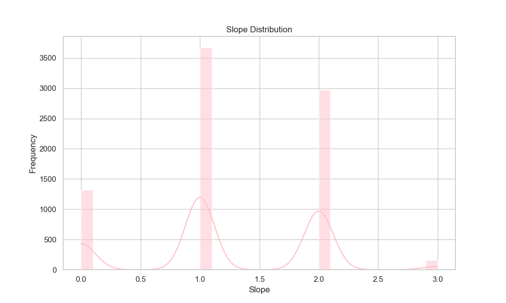
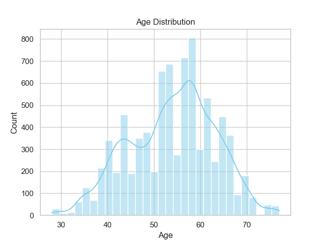
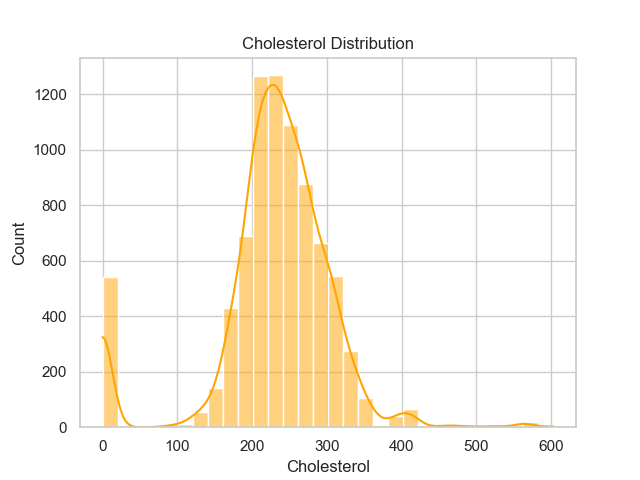

# 🫀 Heart Disease Detection using Machine Learning

This project aims to predict the presence of heart disease in patients using machine learning algorithms. It uses clean, preprocessed medical data with multiple features related to cardiovascular health and classifies whether a patient is likely to have heart disease.

## 📊 Dataset

The dataset contains **8124 rows** of clean data with the following features:

- `age`: Age of the patient
- `sex`: Sex (1 = male; 0 = female)
- `cp`: Chest pain type (0–3)
- `trestbps`: Resting blood pressure (in mm Hg)
- `chol`: Serum cholesterol (in mg/dl)
- `fbs`: Fasting blood sugar > 120 mg/dl (1 = true; 0 = false)
- `restecg`: Resting electrocardiographic results (values 0–2)
- `thalach`: Maximum heart rate achieved
- `exang`: Exercise-induced angina (1 = yes; 0 = no)
- `oldpeak`: ST depression induced by exercise relative to rest
- `slope`: Slope of the peak exercise ST segment
- `ca`: Number of major vessels (0–3) colored by fluoroscopy
- `thal`: Thalassemia (0 = normal; 1 = fixed defect; 2 = reversible defect)
- `heart_disease`: Target variable (1 = disease; 0 = no disease)

> Note: All missing values have been handled and categorical variables normalized.

## 🖼️ Dataset Visualization

Below is a sample visualization of the dataset distribution:

















---

## 🧠 Algorithms Used

- ✅ **XGBoost Classifier**

Both models achieved **98% accuracy**, making them highly reliable for binary classification.

```
               precision    recall  f1-score   support

           0       1.00      0.96      0.98       809
           1       0.96      1.00      0.98       816

    accuracy                           0.98      1625
   macro avg       0.98      0.98      0.98      1625
weighted avg       0.98      0.98      0.98      1625
```
---

## 🚀 How to Use

1. **Clone the repository**
   ```bash
   git clone https://github.com/your-username/heart-disease-detector.git
   cd heart-disease-detector
